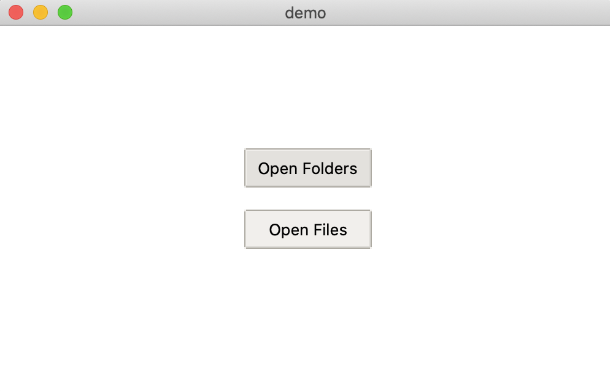
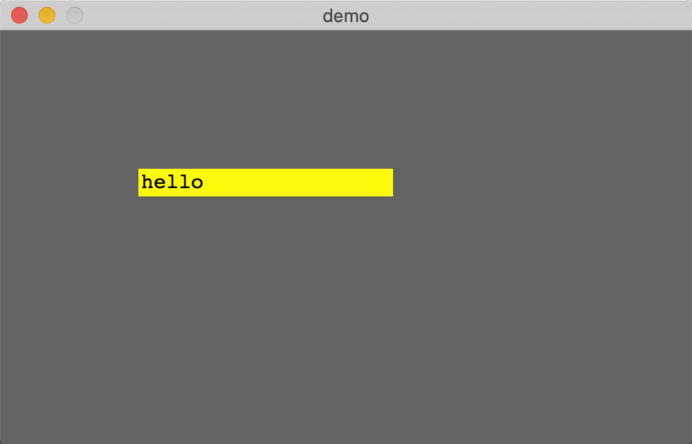
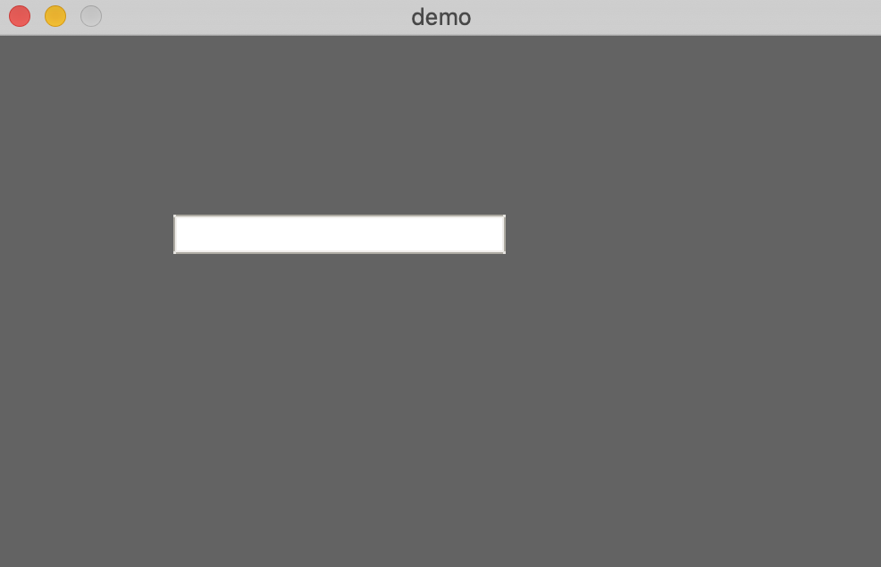
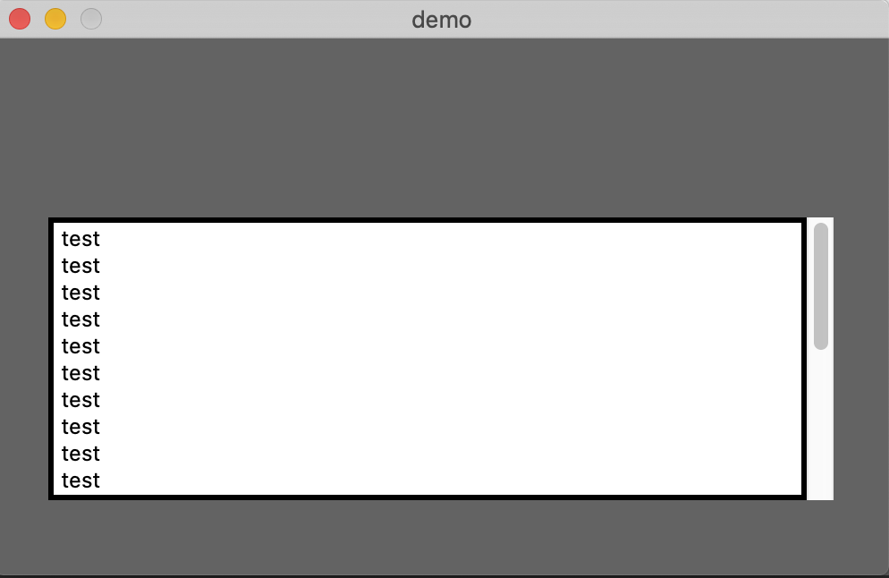
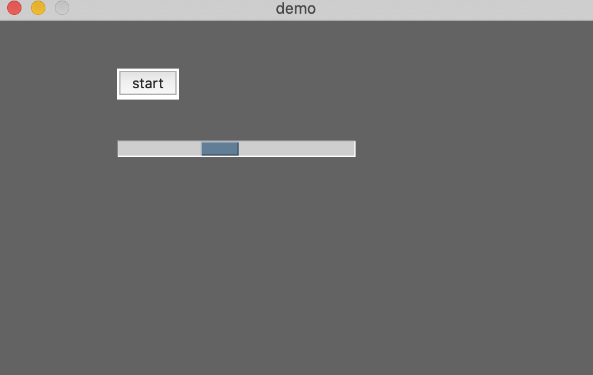
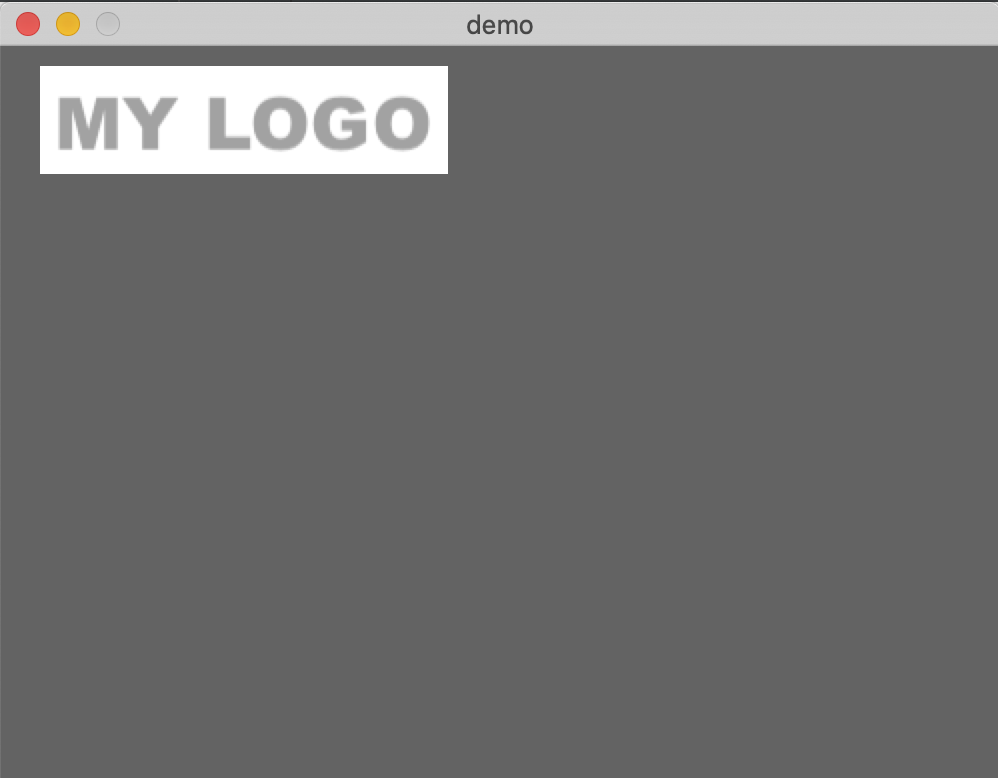

## Tkinter UI Wrapper

## Source

    - cd src/
    - NeoViki_UI_Tk.py

## Examples

#### File Manager 1 ( examples/filemanager_1/demo.png )

#### Label 1 ( examples/label_1 )

#### Input 1 ( examples/input_1 )

#### Display Area 1 ( examples/display_area1 )

#### Button 1 ( examples/button_1/ )

#### Progressbar 1 ( examples/progress_bar )

#### Logo ( examples/logo )

