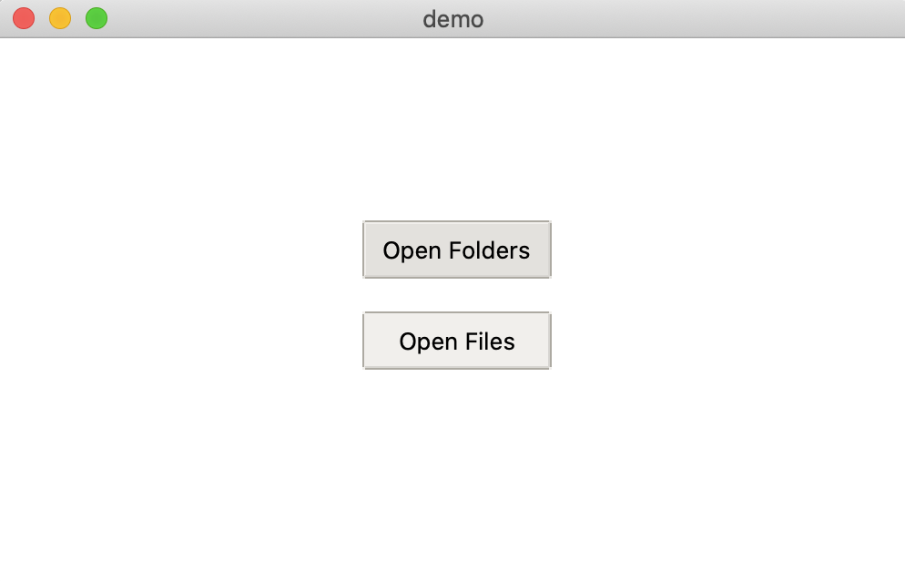
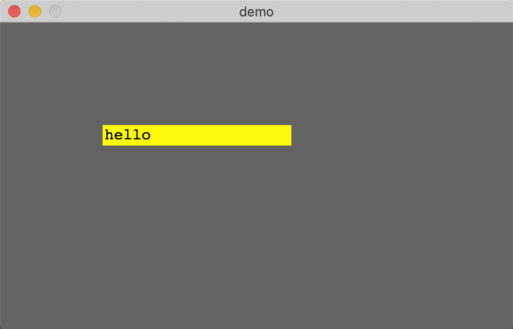
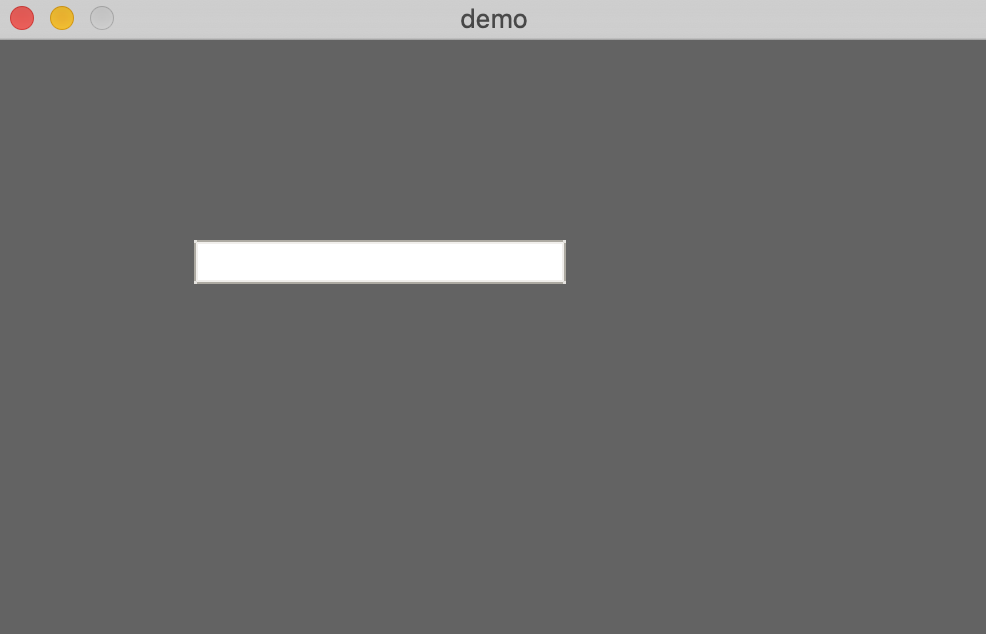
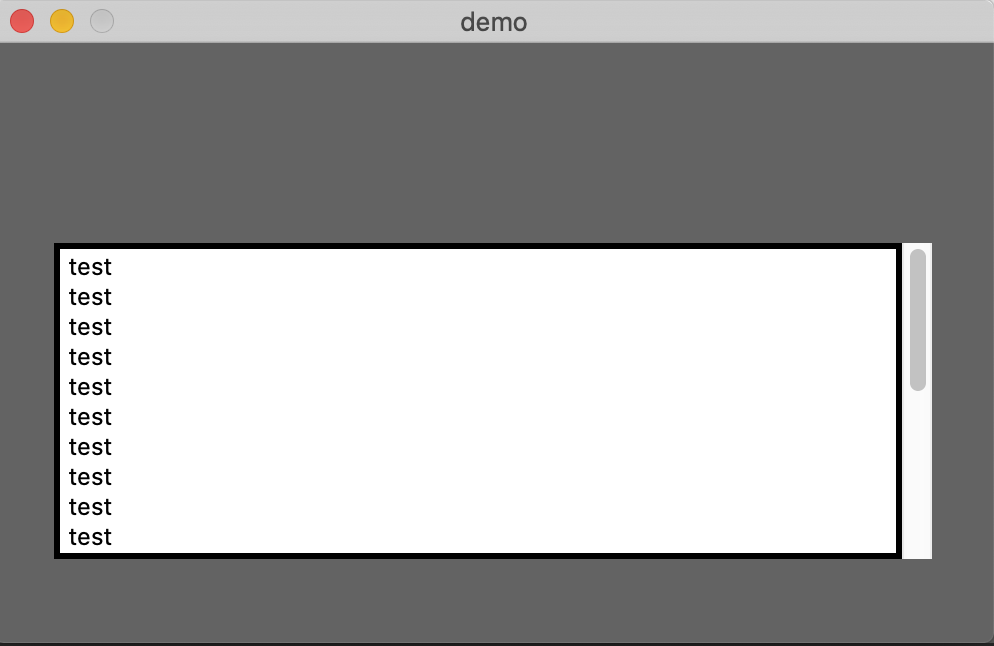
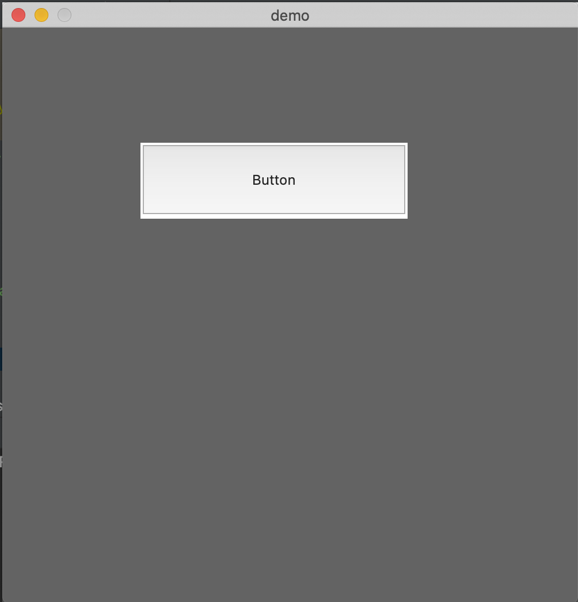
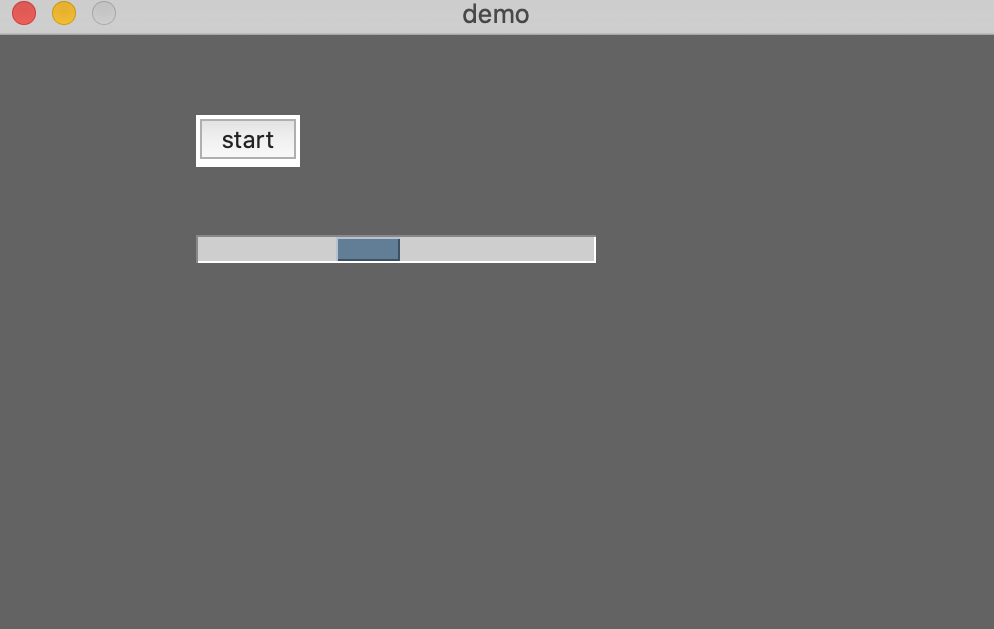
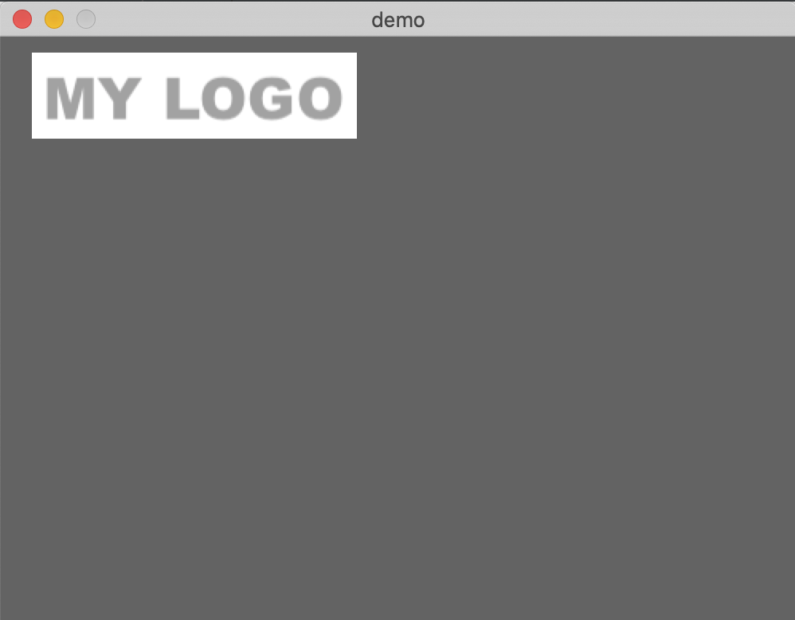
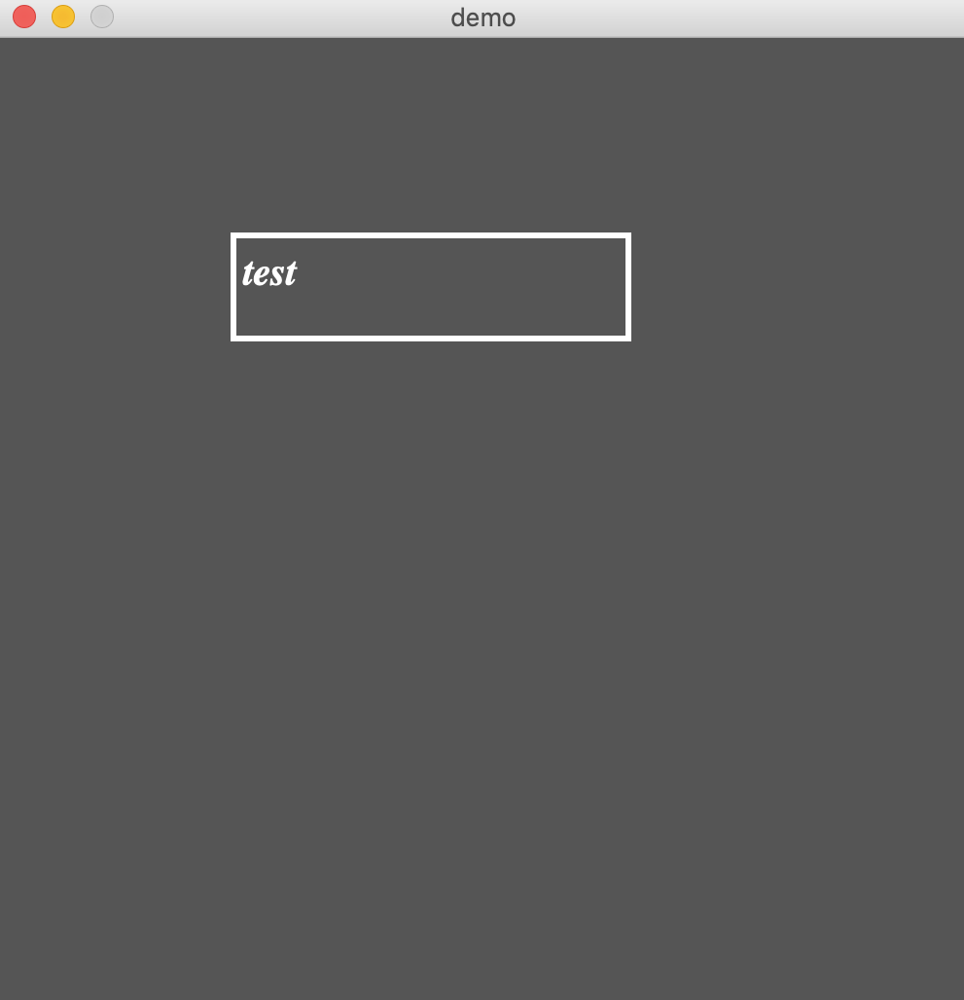

## Tkinter UI Wrapper

## Source

    - cd src/
    - NeoViki_UI_Tk.py

## Prerequisite Python3
 
    - python3 -m pip install tk
    - python3 -m pip install pillow

## Examples

#### File Manager 1 ( examples/0001_filemanager/demo.png )

#### Label 1 ( examples/0002_label )

#### Input 1 ( examples/0003_input )

#### Display Area 1 ( examples/0004_display_area )

#### Button 1 ( examples/0005_button )

#### Progressbar 1 ( examples/0006_progress_bar )

#### Logo ( examples/logo )

#### Canvas ( examples/0008_canvas )

